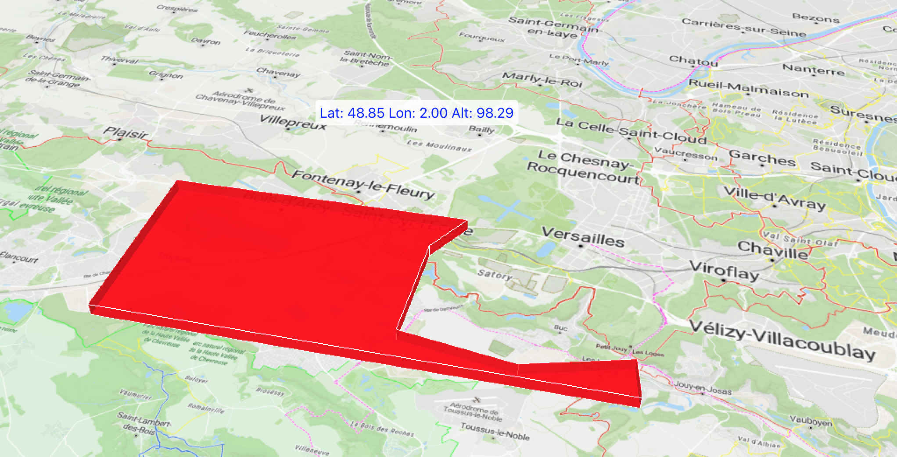

# Projet Cesium avec React

Ce projet utilise Cesium pour afficher une carte 3D à l'intérieur d'une application React. Il utilise également Resium, une bibliothèque qui facilite l'intégration de Cesium avec React.



## Fonctionnalités

- Affichage d'une carte 3D avec un terrain et une couche d'imagerie provenant de MapTiler.
- Affichage des coordonnées (latitude, longitude et altitude) lors du survol de la carte.
- Menus latéraux qui apparaissent lorsque vous approchez le curseur des bords gauche et droit de la fenêtre.

## Configuration

1. **Prérequis** : Assurez-vous d'avoir `node` et `npm` (ou `yarn`) installés sur votre machine.

2. **Installation** :
    ```bash
    npm install
    ```

    Ou si vous utilisez `yarn` :

    ```bash
    yarn install
    ```

3. **Démarrage** :
    ```bash
    npm start
    ```

    Ou avec `yarn` :

    ```bash
    yarn start
    ```

4. **Configuration des clés API** : Vous devez fournir vos clés API pour MapTiler et Cesium Ion. Placez-les dans le fichier `config.js`.

## Structure du projet

- `App.js` : Contient le composant principal de l'application.
- `config.js` : Stocke les clés API pour MapTiler et Cesium Ion.

## Comment ça marche ?

L'application utilise Resium pour intégrer Cesium dans React. Le composant `Viewer` de Resium est utilisé comme composant principal pour afficher la carte 3D.

Lorsque l'utilisateur déplace le curseur sur la carte, l'application affiche les coordonnées géographiques (latitude, longitude) ainsi que l'altitude à l'endroit pointé.

De plus, lorsque l'utilisateur déplace le curseur vers les bords gauche ou droit de la fenêtre, des menus latéraux apparaissent.
